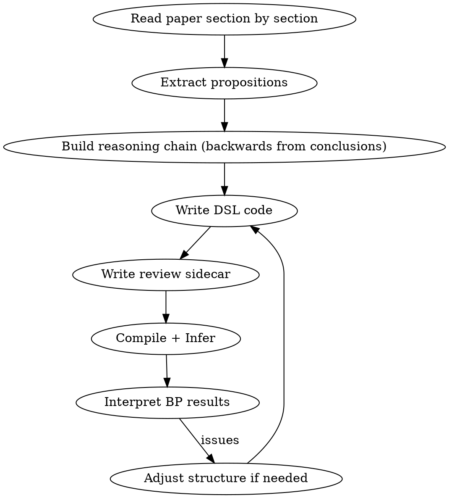
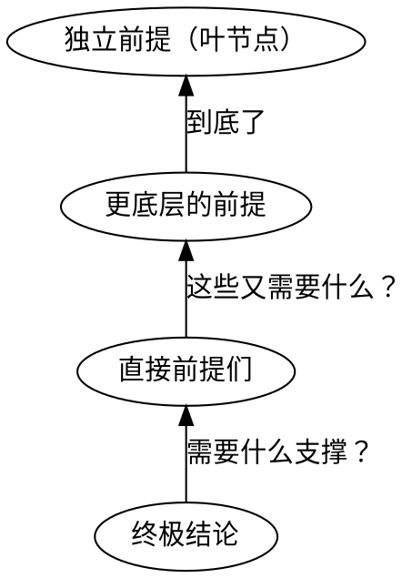

# Paper Formalization

Extract the knowledge structure from a scientific paper into a Gaia knowledge package with claims, reasoning strategies, and review sidecars.

**REQUIRED:** Use gaia-ir-authoring for compilation, validation, and registration mechanics. This skill covers the intellectual process upstream of that.

## Overview



## Step 1: Extract Propositions (section by section)

Read the paper chapter by chapter. For each section, identify three types of objects:

| Type | Criterion | Examples |
|------|-----------|---------|
| **setting** | 不可被质疑的背景事实 | 教科书定义、实验装置描述 |
| **claim** | 可被质疑、可被还原的命题 | 计算结果、理论推导、预测 |
| **question** | 论文要回答的问题 | 研究问题 |

### The Claim Principle

**如果不确定是 setting 还是 claim，标记为 claim。**

判断标准：该命题是否可以被质疑、被推翻、或需要论文提供论证？如果是，就是 claim。只有真正不可能被质疑的事实（如数学定义、已确立的物理常数）才是 setting。

论文自己推导的内容——即使推导很严格——也应该是 claim，因为推导过程本身可能有误。

### Content 必须自含

每个节点的 content 必须是完整的、独立可理解的命题。Reviewer 读到它不需要看上下文就能判断。

```python
# ❌ 不好：需要上下文才能理解
mu_result = claim("计算得到的 μ 值显著超出 RPA 估计。")

# ✅ 好：自含的命题
mu_result = claim(
    "利用变分图形蒙特卡洛方法计算均匀电子气在 $r_s \\in [1,6]$ 区间的 "
    "$\\mu_{E_F}$，结果为：$r_s=1$ 时 $\\mu_{E_F} = 0.28(1)$，$r_s=5$ 时 "
    "$1.3(2)$。这些值显著超出 Morel-Anderson 静态 RPA 估计值。"
)
```

### 公式用 LaTeX

```python
claim("绝热近似要求 $\\omega_D / E_F \\ll 1$。")
```

## Step 2: Build Reasoning Chain (backwards)

**从结论倒推，不要按论文顺序正向连。**



1. 确定**终极结论**
2. 问：这个结论需要什么直接支撑？→ 找到前提
3. 每个前提又需要什么？→ 继续倒推
4. 直到到达**独立前提**（没有进一步支撑的底层命题）

## Step 3: Choose Reasoning Strategy

每一步推理选择连接方式：

### Strategies（推理声明）

| 策略 | 含义 | 用法 |
|------|------|------|
| `claim(given=[...])` | 多前提共同支撑（自动创建 noisy_and） | **最常用**，简单依赖关系 |
| `noisy_and` | 显式多前提联合支撑 | 需要 steps/reason 时 |
| `infer` | 通用条件概率表 | 复杂概率依赖 |
| `abduction` | 溯因：为观察提出假说 | "观察到 X，最可能解释是 H" |
| `analogy` | 类比：source + bridge → target | "A 系统的规律迁移到 B" |
| `extrapolation` | 外推：source + continuity → target | "已知行为延续到未知区间" |
| `elimination` | 排除法 | "排除 A 和 B，所以 C" |
| `case_analysis` | 分情况讨论 | "无论 A 还是 B，都推出 C" |
| `mathematical_induction` | 数学归纳 | "P(0) + P(n)→P(n+1) → ∀n P(n)" |
| `composite` | 多步策略的层次组合 | 复杂多步论证 |

### Operators（确定性逻辑约束）

| 算子 | 含义 | 用法 |
|------|------|------|
| `contradiction(a, b)` | 两者不能同时为真 | 两个互斥的理论/预测 |
| `equivalence(a, b)` | 真值相同 | 两种表述等价 |
| `complement(a, b)` | 真值相反 | 互补命题 |
| `disjunction(*claims)` | 至少一个为真 | 穷举候选 |

### 选择原则

- 简单"A 支撑 B" → `claim(B, given=[A])`
- 多前提共同支撑 → `noisy_and` 或 `claim(given=[A, B, C])`
- 两个结果矛盾 → `contradiction`
- 为现象找解释 → `abduction`
- 每种策略在 BP 中有不同的势函数行为，选择应反映论文实际的论证逻辑

## Step 4: Write Review Sidecar

### 核心原则：只对独立前提给 prior

| 节点类型 | Prior | 说明 |
|----------|-------|------|
| 独立前提（叶节点） | reviewer 判断（0.5–0.95） | 反映证据强度 |
| 推导结论（有 `given` 或是 strategy 的 conclusion） | 0.5（中性） | **必须设置**（validator 要求），但 belief 由 BP 传播 |
| Strategy | conditional_probability | 反映推理强度 |
| Generated claims（如 abduction 的 alternative_explanation） | reviewer 判断 | 通过 `review_generated_claim` 设置 |

```python
from gaia.review import ReviewBundle, review_claim, review_strategy, review_generated_claim

REVIEW = ReviewBundle(
    source_id="self_review",
    objects=[
        # 独立前提 — 根据证据强度给 prior
        review_claim(observation_a, prior=0.90, justification="直接观测结果。"),

        # 推导结论 — 中性 prior，由 BP 传播
        review_claim(derived_conclusion, prior=0.5, justification="推导结论，belief 由 BP 传播。"),

        # 策略 — 条件概率
        review_strategy(my_strategy, conditional_probability=0.88,
                        justification="如果前提成立，结论大概率成立。"),

        # abduction 生成的 interface claim
        review_generated_claim(abduction_strategy, "alternative_explanation",
                               prior=0.25, justification="替代解释不太可能。"),
    ],
)
```

## Step 5: Interpret BP Results

编译并运行推理后，检查：

| 检查项 | 正常 | 异常 |
|--------|------|------|
| 独立前提 | belief ≈ prior（变化小） | belief 被显著拉低 → 下游约束冲突 |
| 推导结论 | belief 从 0.5 被拉高 | belief 低于 0.5 或接近 0 → 见下文 |
| Contradiction | 一边高一边低（"选边"） | 两边都低 → prior 分配有问题 |

### 常见问题与修复

**推导结论的 belief 过低（< 0.2）：**
- **原因：** noisy_and 的乘法效应。多个前提连乘，每个低于 1 都会压低结论
- **修复：** 减少推理链层级，或提高独立前提的 prior

**Contradiction 没有正确"选边"：**
- **原因：** 两边的 prior 设置没有反映实际证据强度差异
- **修复：** 降低应被推翻那一方的 prior

**推导结论没有从前提获得支撑（belief ≈ 0.5）：**
- **原因：** 推理链断裂，某个 strategy 缺少 conditional_probability
- **修复：** 检查 review sidecar 中是否遗漏了 strategy review

## Common Mistakes

| 错误 | 后果 | 修复 |
|------|------|------|
| 给推导结论高 prior（如 0.85） | BP 传播效果被掩盖 | 推导结论统一设 prior=0.5 |
| 给所有 claim 相同的 prior | 失去区分度 | 根据证据强度差异化 |
| contradiction 两边 prior 都高 | BP 两边都压低 | 设低被质疑一方的 prior |
| 推理链太深（>3 层 noisy_and） | 结论 belief 被乘法效应压到接近 0 | 减少层级或合并中间节点 |
| Content 不自含 | Reviewer 无法独立判断 | 每个 content 完整陈述命题 |
| 将可质疑的命题标为 setting | 该命题无法通过 BP 更新 | 疑则标 claim |

## Spec Pointers

- **gaia-ir-authoring** — 编译、验证、注册的操作指南
- `docs/foundations/gaia-lang/dsl.md` — DSL 完整参考
- `docs/foundations/gaia-lang/knowledge-and-reasoning.md` — 知识类型与推理语义
- `docs/foundations/cli/inference.md` — 推理管线（review sidecar、BP）
