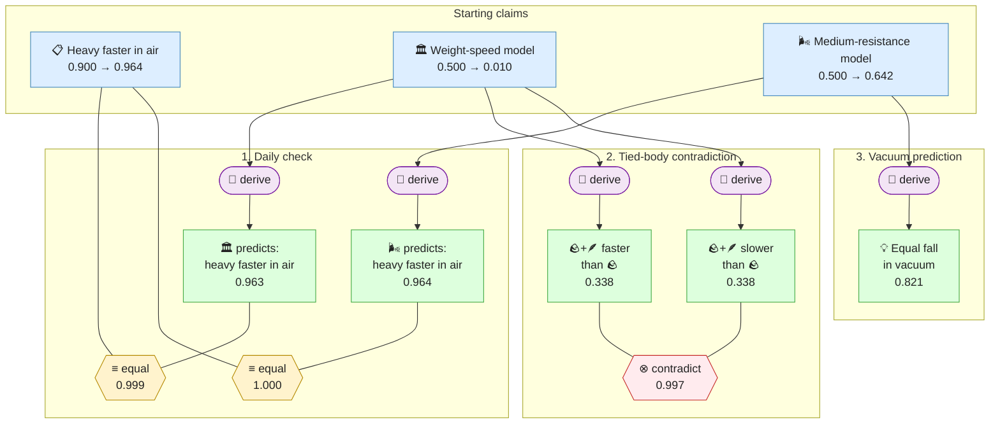

# Gaia Lang

[](https://github.com/SiliconEinstein/Gaia/actions/workflows/ci.yml)
[](https://codecov.io/gh/SiliconEinstein/Gaia)
[](https://pypi.org/project/gaia-lang/)
[](https://opensource.org/licenses/MIT)

Gaia is a formal language for scientific reasoning. It helps you turn informal scientific arguments into explicit propositions, reviewable reasoning steps, and probabilistic belief updates. The recommended v0.5 style is deliberately small: write the uncertain scientific statements as `claim(...)`, keep background context as non-probabilistic `note(...)`, connect claims with `derive(...)`, `observe(...)`, `compute(...)`, and reviewable relations such as `equal(...)` or `contradict(...)`, then let inference compute the marginal belief of every claim.

The probability semantics follow the Jaynesian program: once the information set is made explicit, posterior beliefs are not informal guesses. They are the result of applying probability theory to the declared structure. Gaia's job is to make that structure inspectable enough that humans and agents can argue about the right premises, rather than hiding uncertainty inside prose.

## Quick Example

Galileo's falling-body argument is a good example of the v0.5 style. Daily experience supports both models: heavy bodies often fall faster in air. The difference is that the Aristotelian weight-speed model also produces an internal contradiction in the tied-body thought experiment, while the medium-resistance model can predict the vacuum counterfactual without treating vacuum falling as an observed fact.



Only three independent input claims receive explicit priors. Relation helper claims are folded into the `equal` / `contradict` operator boxes to keep the diagram readable. Derived claims receive no independent prior and are marginalized by inference.

| Claim | Prior → Belief | Change |
|-------|---------------:|-------:|
| `daily_observation` | 0.900 → 0.964 | +0.064 |
| `aristotle_model` | 0.500 → 0.010 | -0.490 |
| `medium_model` | 0.500 → 0.642 | +0.142 |
| `vacuum_equal_fall_prediction` | none → 0.821 | inferred |

The code that produces this:

```python
from gaia.lang import claim, contradict, derive, equal, note

# 📝 Background notes describe setups. They do not carry probabilities.
thought_setup = note("Tied-body setup: a heavy body and a light body are bound together.")
vacuum_setup = note("Vacuum setup: the resisting medium is absent.")

# 📋 The everyday observation both sides must explain.
daily_observation = claim("In air, heavy bodies often fall faster than light bodies.")

# 🏛️ Model A says weight itself sets the natural falling speed.
aristotle_model = claim("Model A: weight itself causes greater natural falling speed.")

# 🌬️ Model B says the observed in-air difference comes from the medium.
medium_model = claim("Model B: in-air speed differences are caused by medium resistance.")

# ✅ First check: both models can match familiar falling in air.
aristotle_daily_prediction = derive(
    "Under Model A, heavy bodies should fall faster in air.",
    given=aristotle_model,
    rationale="Weight directly increases natural falling speed.",
)
equal(
    aristotle_daily_prediction, daily_observation,
    rationale="The daily observation matches Model A's prediction.",
)

medium_daily_prediction = derive(
    "Under Model B, heavy bodies can fall faster than light bodies in air.",
    given=medium_model,
    rationale="Medium resistance can create the observed speed difference.",
)
equal(
    medium_daily_prediction, daily_observation,
    rationale="The daily observation matches Model B's prediction.",
)

# 🤔 Galileo's tied-body test: Model A pulls in two opposite directions.
# If the tied pair is heavier, it should fall faster; if the light body
# retards the heavy body, the same tied pair should fall slower.
composite_faster = derive(
    "The tied composite should fall faster than the heavy body alone.",
    given=aristotle_model,
    background=[thought_setup],
    rationale="The composite has greater total weight.",
)
composite_slower = derive(
    "The tied composite should fall slower than the heavy body alone.",
    given=aristotle_model,
    background=[thought_setup],
    rationale="The slower light body should retard the heavy body.",
)
contradict(
    composite_faster, composite_slower,
    rationale="Model A yields incompatible predictions for the same composite.",
)

# 💡 Counterfactual prediction: remove the medium, remove the in-air difference.
vacuum_equal_fall_prediction = derive(
    "In vacuum, bodies of different weights fall at the same rate.",
    given=medium_model,
    background=[vacuum_setup],
    rationale="If medium resistance causes the difference, no medium removes it.",
)
```

## How it Works

```
Python DSL  →  gaia compile  →  Gaia IR (factor graph)  →  gaia infer  →  beliefs
```

1. **Declare** claims, notes, actions, and relations using the Python DSL.
2. **Compile** to Gaia IR — a canonical graph of knowledge nodes, reviewed actions, and deterministic operators.
3. **Review / gate** the warrants that should enter the information set.
4. **Infer** — exact inference or belief propagation computes posterior marginals for every claim.

The system implements a Jaynes-style Robot architecture: you (or an AI agent) provide the information set; the engine computes the posterior implied by that information. Construction can be wrong — and that is useful. Bad structure shows up as surprising beliefs, uncovered priors, failed gates, or contradictions that force you to expose hidden assumptions.

## Use with AI Agent

Gaia is agent-ready. A [Claude Code](https://claude.ai/code) plugin provides skills that guide the full workflow — from reading a paper to publishing a knowledge package.

```bash
# Add the Gaia marketplace (one-time setup)
/plugin marketplace add SiliconEinstein/Gaia

# Install the gaia plugin
/plugin install gaia
```

### Codex CLI

Gaia skills also work with [OpenAI Codex CLI](https://developers.openai.com/codex/cli). The same `SKILL.md` files are recognized by both agents.

```bash
# Add the Gaia marketplace
codex marketplace add https://github.com/SiliconEinstein/Gaia

# Or manually clone and copy skills
git clone https://github.com/SiliconEinstein/Gaia.git
cp -r Gaia/skills/* ~/.codex/skills/
```

After installation, invoke skills with the `$` prefix:
- `$gaia formalization` — Formalize a paper into a Gaia package
- `$gaia review` — Refine priors after inspecting BP results
- `$gaia publish` — Generate GitHub presentation and push

### Formalize a Paper End-to-End

1. **`/gaia:formalization`** — Point Claude at your paper (PDF or text in `artifacts/`). The skill guides a six-pass process: extract knowledge nodes, connect reasoning strategies, check completeness, refine strategy types, verify structural integrity, and polish for readability. Output: a compilable Gaia package with `priors.py`.

2. **`/gaia:review`** — Refine priors after inspecting BP results. Use this when you want to iterate on `priors.py` values, re-run `gaia compile && gaia infer`, and watch how beliefs change.

3. **`/gaia:publish`** — After `gaia render --target github` generates the skeleton, this skill fills in the narrative README, writes section summaries, and pushes to GitHub. Your repo gets a human-readable presentation of the formalized knowledge with interactive graphs.

4. **`gaia register`** — Submit the package to the [Gaia Official Registry](https://github.com/SiliconEinstein/gaia-registry) so others can `gaia add` it as a dependency.

### All Skills

| Skill | Purpose |
|-------|---------|
| `/gaia` | Entry point — routes to the right skill based on your request |
| `/gaia:formalization` | Six-pass paper formalization: extract nodes → connect strategies → check completeness → refine types → verify structure → polish |
| `/gaia:gaia-cli` | CLI reference — `gaia init`, `compile`, `infer`, `check`, `register`, `add` |
| `/gaia:gaia-lang` | DSL reference — knowledge types, operators, strategies, metadata, package structure |
| `/gaia:review` | Refine priors — adjust `priors.py`, re-run inference, iterate on beliefs |
| `/gaia:publish` | Generate GitHub presentation (`render --target github` skeleton → narrative README → push) |

## Install

```bash
pip install gaia-lang
```

For development:

```bash
git clone https://github.com/SiliconEinstein/Gaia.git
cd Gaia && uv sync
```

## Gallery

Published Gaia knowledge packages:

| Package | Source | Knowledge nodes |
|---------|--------|-----------------|
| [SuperconductivityElectronLiquids.gaia](https://github.com/kunyuan/SuperconductivityElectronLiquids.gaia) | arXiv:2512.19382 — Superconductivity in Electron Liquids | 78 |
| [watson-rfdiffusion-2023-gaia](https://github.com/kunyuan/watson-rfdiffusion-2023-gaia) | Watson et al. 2023 — De novo design of protein structure and function with RFdiffusion | 128 |
| [GalileoFallingBodies.gaia](https://github.com/kunyuan/GalileoFallingBodies.gaia) | Galileo's falling bodies thought experiment | 7 |

## CLI Workflow

```
gaia init → gaia add → /gaia:formalization → gaia compile → gaia infer → gaia render → /gaia:publish → gaia register
(scaffold)  (add deps)  (author DSL + priors)  (DSL → IR)   (BP beliefs)  (present)    (fill narrative) (registry PR)
```

`gaia ...` steps are CLI commands; `/gaia:...` steps are [Claude Code](https://claude.ai/code) skills provided by this repo's plugin (see "All Skills" above) — invoke them by typing the slash command in a Claude Code session.

| Command | Purpose |
|---------|---------|
| `gaia init <name>` | Scaffold a new Gaia knowledge package |
| `gaia add <package>` | Install a registered Gaia package from the [official registry](https://github.com/SiliconEinstein/gaia-registry) |
| `gaia compile [path]` | Compile Python DSL to Gaia IR (`.gaia/ir.json`) |
| `gaia check [path]` | Validate package structure and IR consistency (used by registry CI) |
| `gaia check --brief [path]` | Show per-module warrant structure overview (claims, strategies, priors) |
| `gaia check --show <name> [path]` | Expand a module or claim label with full warrant trees |
| `gaia check --hole [path]` | Detailed prior review report for all independent claims (holes + covered) |
| `gaia infer [path]` | Run inference with explicit priors from `priors.py` and accepted warrants |
| `gaia infer --depth 1 [path]` | Joint cross-package inference merging dependency factor graphs |
| `gaia render --target github [path]` | Generate GitHub presentation skeleton (`.github-output/`): wiki, README, React Pages, graph.json |
| `gaia render --target docs [path]` | Generate per-module detailed reasoning to `docs/detailed-reasoning.md` |
| `gaia render [path]` | Default: render both docs and github targets (`--target all`) |
| `gaia starmap [path]` | Emit a starmap of a Gaia knowledge package in three formats. Default `--format html` (`.gaia/starmap.html`): single-file interactive WebGL viewer (~10k nodes), double-click to open, no server required. `--format dot` (`.gaia/starmap.dot`): paper-ready Graphviz source. `--format svg` (`.gaia/starmap.svg`): rendered via Graphviz with embedded glow filters when `--theme stellaris`. `--theme {light,stellaris,dark}` (default `light`): `stellaris`/`dark` is a deep-space palette with sfdp force-directed layout, multi-layer SVG glows on contradictions, gold-edge support strategies, and root-claim highlight |
| `gaia starmap-replay [path]` | **Experimental** (scaffold v4, frozen — not actively iterated). Time-line replay of inquiry / BP iterations against a starmap fixture. Default output: `.gaia/starmap-replay.html`. See scaffold for current capability; future iterations live on a separate branch |
| `gaia inquiry review [path]` | Semantic review loop. Runs BP and surfaces diagnostic findings on the package (low-belief leaves, contradictions, hypothesis equipoise, etc.). Subcommands: `focus`, `reject`, `obligation`, `hypothesis`, `tactics` for managing the inquiry state |
| `gaia trace verify <trace>` | ARM execution-trace tooling. `verify`: schema + hash-chain check. `review`: full eight-section review. `show`: print event stream in `tactic_log` style |
| `gaia register [path]` | Submit package to the [Gaia Official Registry](https://github.com/SiliconEinstein/gaia-registry) |

## Quick Start

This walkthrough uses the Galileo example from above.

**1. Initialize and write code**

```bash
gaia init galileo-falling-bodies-gaia
cd galileo-falling-bodies-gaia
```

Place the DSL code from the Quick Example into `src/galileo_falling_bodies/__init__.py`.

**2. Compile and validate**

```bash
gaia compile .
gaia check .
```

**3. Assign priors** for independent probabilistic inputs via `priors.py`:

`src/galileo_falling_bodies/priors.py`:

```python
from . import aristotle_model, daily_observation, medium_model

PRIORS = {
    daily_observation: (0.9, "Familiar empirical background in air."),
    aristotle_model: (0.5, "Neutral before the thought experiment."),
    medium_model: (0.5, "Neutral before the thought experiment."),
}
```

The v0.5 prior contract is deliberately strict:

- Give external priors only to independent probabilistic inputs that are load-bearing for exported goals. Root `observe(...)` claims count: grounding and review are qualitative, so the observed claim still needs a probability source or MaxEnt.
- Do not assign priors to claims concluded by `derive(...)`, `compute(...)`, or `observe(..., given=...)`; BP marginalizes them from the declared graph.
- Do not assign priors to structural/helper claims from `~`, `&`, `|`, `infer(...)`, `associate(...)`, `equal(...)`, `contradict(...)`, `exclusive(...)`, or generated formalization helpers.
- Run `gaia check --hole .` before inference. Claims reported as MaxEnt are independent degrees of freedom without external priors; leaving them unset means Gaia uses the maximum-entropy distribution over those free variables, subject to the hard logical constraints already declared.

**4. Infer and publish**

```bash
gaia compile .                    # re-compile to inject priors into metadata
gaia infer .                      # compute beliefs via belief propagation
gaia render . --target github     # generate GitHub presentation skeleton
```

Then use `/gaia:publish` to fill in the narrative, and `gaia register` to submit to the official registry.

For the full tutorial, see [CLI Workflow](docs/foundations/cli/workflow.md).

## DSL Surface

### Recommended v0.5 Authoring Surface

#### Knowledge

| Function | Description |
|----------|-------------|
| `claim(content, *, background, parameters, provenance)` | Scientific assertion — the only knowledge type carrying probability |
| `note(content, *, format="markdown")` | Background context — no probability, no BP participation |
| `question(content)` | Open research inquiry |

#### Action Verbs

| Function | Description |
|----------|-------------|
| `observe(conclusion, *, given, background, rationale)` | Empirical warrant; a root observation also records grounding |
| `derive(conclusion, *, given, background, rationale)` | Deterministic derivation; lowers to hard Jaynes conditional implication after review |
| `compute(ClaimType, *, fn, given, background, rationale)` | Deterministic computation with claim inputs |
| `infer(evidence, *, hypothesis, background, rationale, p_e_given_h, p_e_given_not_h)` | Probabilistic prediction/evidence link; returns a reviewable likelihood helper claim |
| `associate(a, b, *, p_a_given_b, p_b_given_a, prior_a=None, prior_b=None, background=None, rationale="")` | Symmetric probabilistic association; returns a reviewable association helper claim |
| `@compose(name, version, background=None, warrants=None, rationale="", label=None)` | Decorates a Python workflow and records its child actions as a reviewable Compose DAG |

`observe(...)`, `derive(...)`, and `compute(...)` return their produced conclusion claim. `infer(...)`, `associate(...)`, and relation verbs return generated helper claims because the public semantic object is the declared relation. A `@compose` call returns the wrapped function's conclusion claim while also recording a Compose action in the compiled IR.

#### Relations

| Function | Semantics |
|----------|-----------|
| `equal(a, b)` | Reviewable claim that A and B have the same truth value |
| `contradict(a, b)` | Reviewable claim that A and B cannot both be true |
| `exclusive(a, b)` | Reviewable claim that exactly one of A and B is true |

#### Structural Proposition Helpers

| Function | Description |
|----------|-------------|
| `not_(a)` / `~a` | Boolean negation helper |
| `and_(a, b, ...)` / `a & b` | Boolean conjunction helper |
| `or_(a, b, ...)` | Boolean disjunction helper |

The infix shorthand forms are `~a`, `a & b`, and `a | b`.

Legacy and experimental strategy functions such as `support`, `deduction`, `abduction`, and `induction` are documented separately, but new v0.5 packages should prefer the action/relation surface above. If a step is uncertain, expose the uncertainty as an explicit premise or use `infer(...)`; do not hide it inside a prose rationale.

## Architecture

```
gaia/
├── lang/       DSL runtime, declarations, and compiler
├── ir/         Gaia IR schema, validation, formalization
├── bp/         Belief propagation engine (loopy BP, junction tree, generalized BP)
├── cli/        CLI commands (init, compile, check, add, infer, render, starmap, inquiry, trace, register)
├── inquiry/    Semantic review loop — diagnostic kinds, focus/reject/obligation/hypothesis state
└── trace/      ARM execution-trace verifier and reviewer (schema + hash chain)
```

## Documentation

- [Plausible Reasoning Theory](docs/foundations/theory/01-plausible-reasoning.md) — Polya, Cox, Jaynes: why probability is the unique formalism
- [DSL Reference](docs/foundations/gaia-lang/dsl.md)
- [Package Model](docs/foundations/gaia-lang/package.md)
- [Knowledge & Reasoning Semantics](docs/foundations/gaia-lang/knowledge-and-reasoning.md)
- [CLI Workflow](docs/foundations/cli/workflow.md)
- [Gaia IR Specification](docs/foundations/gaia-ir/02-gaia-ir.md)
- [Registry Design](docs/specs/2026-04-02-gaia-registry-design.md)

## Testing

```bash
pytest
ruff check .
ruff format --check .
```

## License

MIT
