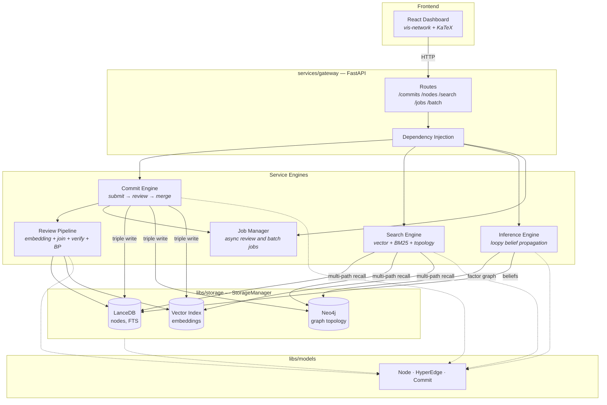

# Gaia

[](https://github.com/SiliconEinstein/Gaia/actions/workflows/ci.yml)
[](https://codecov.io/gh/SiliconEinstein/Gaia)
[](https://opensource.org/licenses/MIT)

Large Knowledge Model (LKM) — a billion-scale reasoning hypergraph for knowledge representation and inference.

Gaia stores propositions as **nodes** and reasoning relationships as **hyperedges**, with a Git-like commit workflow (submit → review → merge) and probabilistic inference via loopy belief propagation.

For the current repo/module layout, start with [docs/module-map.md](docs/module-map.md). For the full documentation index, see [docs/README.md](docs/README.md).

## Quick Start

```bash
# Install
pip install -e ".[dev]"

# Seed local databases (requires Neo4j running)
python scripts/seed_database.py \
  --fixtures-dir tests/fixtures \
  --db-path ./data/lancedb/gaia

# Run API server
GAIA_LANCEDB_PATH=./data/lancedb/gaia \
  uvicorn services.gateway.app:create_app --factory --reload --port 8000

# Run frontend dashboard
cd frontend && npm install && npm run dev
```

## Architecture



## Project Layout

| Path | Responsibility |
|------|----------------|
| `libs/` | shared models, embeddings, storage backends, vector search abstraction |
| `services/` | backend runtime modules: gateway, commit, search, inference, review pipeline, jobs |
| `frontend/` | React dashboard |
| `scripts/` | seeding and migration utilities |
| `tests/` | unit and integration coverage |
| `docs/` | current module map, design references, examples, archived plans |

### Storage

| Backend | Purpose |
|---------|---------|
| **LanceDB** | Node content, metadata, BM25 full-text search |
| **Neo4j** | Graph topology, hyperedge relationships |
| **Vector Index** | Embedding similarity search (local impl uses LanceDB) |

### API

| Area | Endpoints |
|------|-----------|
| Commits | `GET/POST /commits`, `POST /commits/{id}/review`, `GET /commits/{id}/review`, `POST /commits/{id}/merge` |
| Read | `GET /nodes/{id}`, `GET /hyperedges/{id}`, `GET /nodes/{id}/subgraph`, `GET /nodes/{id}/subgraph/hydrated`, `GET /stats` |
| Search | `POST /search/nodes`, `POST /search/hyperedges` |
| Batch | `POST /commits/batch`, `POST /nodes/batch`, `POST /hyperedges/batch`, `POST /nodes/subgraph/batch`, `POST /search/nodes/batch`, `POST /search/hyperedges/batch` |
| Jobs | `GET /jobs/{job_id}`, `GET /jobs/{job_id}/result`, `DELETE /jobs/{job_id}` |

## Documentation

| Path | Purpose |
|------|---------|
| [docs/module-map.md](docs/module-map.md) | current repo structure and module boundaries |
| [docs/architecture-rebaseline.md](docs/architecture-rebaseline.md) | structural issues exposed by implementation and recommended cleanup direction |
| [docs/foundations/README.md](docs/foundations/README.md) | foundation-first planning area for reworking product scope, graph/schema, modules, and APIs |
| [docs/design/](docs/design/) | design and theory references |
| [docs/examples/](docs/examples/) | reasoning examples |
| [docs/plans/](docs/plans/) | historical implementation plans and API drafts |

## Testing

```bash
pytest                    # all tests (requires Neo4j)
pytest --cov=libs --cov=services tests  # with coverage
ruff check . && ruff format --check .   # lint
```

Tests use temporary directories for LanceDB and a real Neo4j instance. CI runs Neo4j as a Docker service container.

## Tech Stack

**Backend:** Python 3.12, FastAPI, Pydantic v2, LanceDB, Neo4j, NumPy, PyArrow

**Frontend:** React, TypeScript, Vite, Ant Design, React Query, vis-network, KaTeX
