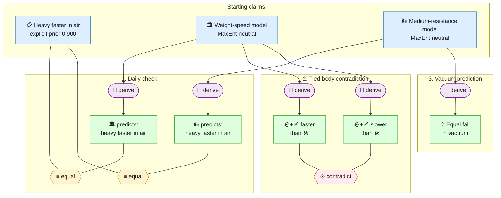

# Gaia Lang

[](https://github.com/SiliconEinstein/Gaia/actions/workflows/ci.yml)
[](https://github.com/SiliconEinstein/Gaia/actions/workflows/nightly.yml)
[](https://siliconeinstein.github.io/Gaia/)
[](https://pypi.org/project/gaia-lang/)
[](https://opensource.org/licenses/MIT)

> **Contributing?** Read [`AGENTS.md`](AGENTS.md).

Gaia is a formal language for scientific reasoning. It helps you turn informal scientific arguments into explicit propositions, reviewable reasoning steps, and probabilistic belief updates. The recommended v0.5 style is deliberately small: write the uncertain scientific statements as `claim(...)`, keep background context as non-probabilistic `note(...)`, connect claims with `derive(...)`, `observe(...)`, `compute(...)`, and reviewable relations such as `equal(...)` or `contradict(...)`, then let inference compute the marginal belief of every claim.

The probability semantics follow the Jaynesian program: once the information set is made explicit, posterior beliefs are not informal guesses. They are the result of applying probability theory to the declared structure. Gaia's job is to make that structure inspectable enough that humans and agents can argue about the right premises, rather than hiding uncertainty inside prose.

## Quick Example

Galileo's falling-body argument is a good example of the v0.5 style. Daily experience supports both models: heavy bodies often fall faster in air. The difference is that the Aristotelian weight-speed model also produces an internal contradiction in the tied-body thought experiment, while the medium-resistance model can predict the vacuum counterfactual without treating vacuum falling as an observed fact.



Only the everyday observation receives an explicit prior. The two model
hypotheses are independent inputs, but the example intentionally leaves them
without author priors: Gaia applies MaxEnt, which gives the neutral starting
point `0.5` without pretending that `0.5` is a sourced prior. Relation helper
claims are folded into the `equal` / `contradict` operator boxes to keep the
diagram readable. Derived claims receive no independent prior and are
marginalized by inference.

Current prior coverage for this example:

| Claim | Prior source | Meaning |
|-------|--------------|---------|
| `daily_observation` | `user_priors`, value `0.9` | Familiar in-air empirical background |
| `aristotle_model` | MaxEnt | Independent model hypothesis with no sourced prior |
| `medium_model` | MaxEnt | Independent model hypothesis with no sourced prior |
| `vacuum_equal_fall_prediction` | derived | No external prior; produced from the medium-resistance model path |

`gaia run infer` is a local numerical preview over the compiled graph. It does not
require `.gaia/review_manifest.json` entries to be accepted before showing how
the authored reasoning changes beliefs. Review status is still important for
`gaia build check --gate`, `gaia inquiry review`, traces, and publication decisions,
but it is not a numeric prior and does not suppress local preview beliefs. The
current compiled graph gives:

| Claim | Local preview belief |
|-------|-------------------------------:|
| `daily_observation` | 0.964 |
| `aristotle_model` | 0.008 |
| `medium_model` | 0.643 |
| `vacuum_equal_fall_prediction` | 0.821 |

The core DSL for this example is:

```python
from gaia.engine.lang import claim, contradict, derive, equal, note

# 📝 Background notes describe setups. They do not carry probabilities.
thought_setup = note("Tied-body setup: a heavy body and a light body are bound together.")
vacuum_setup = note("Vacuum setup: the resisting medium is absent.")

# 📋 The everyday observation both sides must explain.
daily_observation = claim("In air, heavy bodies often fall faster than light bodies.")

# 🏛️ Model A says weight itself sets the natural falling speed.
aristotle_model = claim("Model A: weight itself causes greater natural falling speed.")

# 🌬️ Model B says the observed in-air difference comes from the medium.
medium_model = claim("Model B: in-air speed differences are caused by medium resistance.")

# ✅ First check: both models can match familiar falling in air.
aristotle_daily_prediction = derive(
    "Under Model A, heavy bodies should fall faster in air.",
    given=aristotle_model,
    rationale="Weight directly increases natural falling speed.",
)
equal(
    aristotle_daily_prediction, daily_observation,
    rationale="The daily observation matches Model A's prediction.",
)

medium_daily_prediction = derive(
    "Under Model B, heavy bodies can fall faster than light bodies in air.",
    given=medium_model,
    rationale="Medium resistance can create the observed speed difference.",
)
equal(
    medium_daily_prediction, daily_observation,
    rationale="The daily observation matches Model B's prediction.",
)

# 🤔 Galileo's tied-body test: Model A pulls in two opposite directions.
# If the tied pair is heavier, it should fall faster; if the light body
# retards the heavy body, the same tied pair should fall slower.
composite_faster = derive(
    "The tied composite should fall faster than the heavy body alone.",
    given=aristotle_model,
    background=[thought_setup],
    rationale="The composite has greater total weight.",
)
composite_slower = derive(
    "The tied composite should fall slower than the heavy body alone.",
    given=aristotle_model,
    background=[thought_setup],
    rationale="The slower light body should retard the heavy body.",
)
contradict(
    composite_faster, composite_slower,
    rationale="Model A yields incompatible predictions for the same composite.",
)

# 💡 Counterfactual prediction: remove the medium, remove the in-air difference.
vacuum_equal_fall_prediction = derive(
    "In vacuum, bodies of different weights fall at the same rate.",
    given=medium_model,
    background=[vacuum_setup],
    rationale="If medium resistance causes the difference, no medium removes it.",
)
```

The belief table above also uses the `priors.py` pattern shown in the quick
start below; the complete runnable package lives in
`examples/galileo-v0-5-gaia`.

## How it Works

```
Python DSL  →  gaia build compile  →  Gaia IR (factor graph)  →  gaia run infer  →  beliefs
```

1. **Declare** claims, notes, actions, and relations using the Python DSL.
2. **Compile** to Gaia IR — a canonical graph of knowledge nodes, actions, and deterministic operators.
3. **Infer** locally — exact inference or belief propagation previews posterior marginals for every claim in the compiled graph.
4. **Review / gate** warrants separately when deciding whether the package is ready to publish or register.

The system implements a Jaynes-style Robot architecture: you (or an AI agent) provide the declared structure; the engine computes the posterior implied by that structure. Construction can be wrong — and that is useful. Bad structure shows up as surprising beliefs, uncovered priors, failed gates, or contradictions that force you to expose hidden assumptions.

## Install

```bash
pip install gaia-lang
```

For development:

```bash
git clone https://github.com/SiliconEinstein/Gaia.git
cd Gaia && uv sync
```

## Gallery

Published Gaia knowledge packages:

| Package | Source | Knowledge nodes |
|---------|--------|-----------------|
| [SuperconductivityElectronLiquids.gaia](https://github.com/kunyuan/SuperconductivityElectronLiquids.gaia) | arXiv:2512.19382 — Superconductivity in Electron Liquids | 78 |
| [watson-rfdiffusion-2023-gaia](https://github.com/kunyuan/watson-rfdiffusion-2023-gaia) | Watson et al. 2023 — De novo design of protein structure and function with RFdiffusion | 128 |
| [GalileoFallingBodies.gaia](https://github.com/kunyuan/GalileoFallingBodies.gaia) | Galileo's falling bodies thought experiment | 7 |

## CLI Workflow

The CLI is self-documenting. Run `gaia --help` for the top-level group overview, or `gaia <group> --help` (e.g. `gaia author --help`, `gaia build --help`, `gaia bayes --help`) for the per-group reference with options and minimal usage examples.

Authoring proceeds via `gaia author <verb>` (claim / note / question / equal / contradict / exclusive / decompose / derive / observe / compute / infer / associate / parameter / register-prior / variable / depends-on / candidate-relation / materialize / compose / composition); package operations via `gaia pkg <verb>` (add / add-module / register / scaffold); Bayesian modelling via `gaia bayes <verb>`. The `build` / `run` / `inspect` / `trace` / `inquiry` groups round out the pipeline; `review` is a help-visible skeleton for forthcoming reviewer tooling.

For the full annotated command reference, see [`docs/for-users/cli-commands.md`](docs/for-users/cli-commands.md).

## Quick Start

See the [Quick Start tutorial](docs/for-users/quick-start.md) for the full step-by-step walkthrough — `init` through `compile`, `check`, `infer`, and `render`. The v0.5 prior contract — when to register priors, when not to, MaxEnt fallback semantics, and the Cromwell bound — is documented in [`docs/for-users/cli-commands.md#prior-assignment-contract`](docs/for-users/cli-commands.md#prior-assignment-contract).

## Architecture

```
gaia/
├── engine/     DSL runtime, Gaia IR schema, validation, compiler, BP engine, inquiry, and trace
└── cli/        CLI command groups (build, run, inspect, pkg, inquiry, trace)
```

## Documentation

- [Plausible Reasoning Theory](docs/foundations/theory/01-plausible-reasoning.md) — Polya, Cox, Jaynes: why probability is the unique formalism
- [Language Reference](docs/for-users/language-reference.md)
- [Generated DSL API](docs/reference/dsl.md)
- [Package Model](docs/foundations/gaia-lang/package.md)
- [Knowledge & Reasoning Semantics](docs/foundations/gaia-lang/knowledge-and-reasoning.md)
- [CLI Workflow](docs/foundations/cli/workflow.md)
- [Gaia IR Specification](docs/foundations/gaia-ir/02-gaia-ir.md)
- [Registry Design](docs/specs/2026-04-02-gaia-registry-design.md)

## Testing

```bash
make test       # fast local slice; excludes slow regression snapshots and scale tests
make test-slow  # slow regression slice
make test-all   # full suite with coverage
```

## License

MIT
