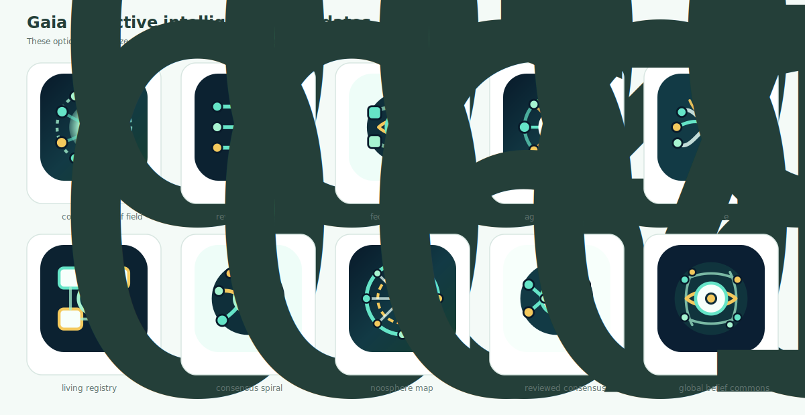

# Gaia Icon Options

This sheet contains Gaia icon directions for review. The current preferred set
emphasizes Gaia as collective intelligence: many authors, agents, packages, and
reviewers forming a shared belief field.

The first exploratory sheet is also preserved:

Pick a number from 01 to 10. The selected option can then be extracted into `docs/assets/gaia-icon.svg` and used in the README.
