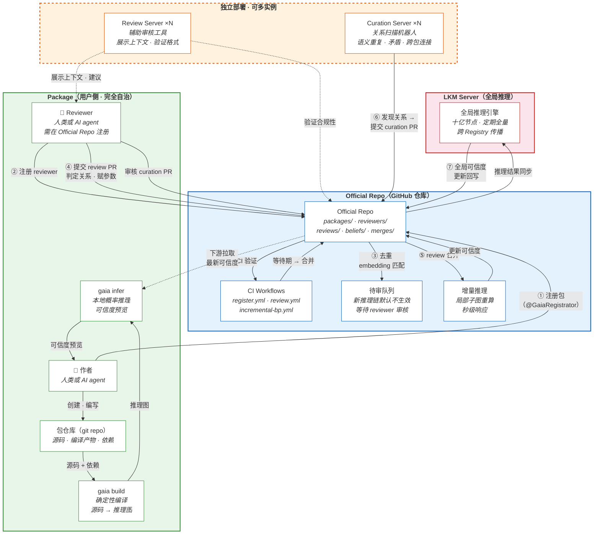

# 去中心化架构

> **Status:** Current canonical

本文档是 Gaia 去中心化包管理和推理架构的总纲。具体的业务流程见各子文档。

## 参与者

| 参与者 | 性质 | 职责 |
|--------|------|------|
| **作者**（人类或 AI agent） | 用户侧 | 创建知识包，声明依赖，编译，本地推理，发布 |
| **Reviewer**（人类或 AI agent） | 用户侧 | 审核新证据，判定推理关系，赋予参数 |
| **作者的 GitHub 仓库** | 用户侧 | 托管知识包源码和编译产物 |
| **Official Repo**（官方注册仓库） | GitHub | 注册包和 reviewer 的元数据，存储审核记录和推理结果 |
| **Review Server** | 独立部署 | 为 reviewer 提供工具支持，自动验证 review 格式合规性。可多实例 |
| **Curation Server** | 独立部署 | 自动发现跨包关系的扫描机器人。可多实例 |
| **LKM Server** | 中心计算 | 十亿节点全局推理引擎 |

### Review Server 和 Curation Server 的定位

Review Server 和 Curation Server **不是 LKM Server 的组件**，而是独立部署的服务：

- **可多实例：** 不同机构、不同团队可以各自部署自己的 Review Server 或 Curation Server
- **无特权：** 和普通贡献者一样，通过 PR 与 Official Repo 交互
- **格式约束：** 只要输出符合 Official Repo 规定的 PR 格式，任何实现都可以参与
- **本质是机器人：** Curation Server 是自动扫描机器人（定期扫描、发现关系、提交 PR），Review Server 是辅助审核的工具机器人（展示上下文、验证格式、提供建议）

类比：reviewer 用什么编辑器写论文不重要，重要的是论文符合期刊格式。同理，用谁的 Review Server 不重要，重要的是 review PR 符合 Official Repo 的格式。

## GitHub 作为通用交互面

所有参与者通过 GitHub 交互——一切都是 git commit，一切通过 PR，一切可审计：

| 参与者 | 交互方式 |
|--------|---------|
| 作者 | git push 到自己的包仓库；向 official repo 请求注册 |
| Reviewer | 向 official repo 提交 review PR |
| Review Server | 自动验证 review PR 的合规性；为 reviewer 提供建议 |
| Curation Server | 向 official repo 提交 curation PR（发现的关系、合并提议等） |
| LKM Server | 读取 official repo 的推理图，回写全局推理结果 |

## 整体架构图



**图例：** 实线 = 数据/控制流，虚线 = 辅助/拉取。橙色虚线框 = 独立部署的机器人（可多实例）。

## 架构分层

| 层 | 组成 | 性质 |
|----|------|------|
| **Package** | 作者的 git 仓库 | 完全自治，可离线工作 |
| **Official Repo** | GitHub 仓库 | 可选的聚合层，注册包和 reviewer，存储审核和推理结果 |
| **Review Server** | 独立部署的审核工具 | 可多实例，任何人可部署，通过 PR 交互 |
| **Curation Server** | 独立部署的扫描机器人 | 可多实例，任何人可部署，通过 PR 交互 |
| **LKM Server** | 全局推理引擎 | 十亿节点 BP，定期全量 + 事件增量 |

- **Package** 是基础——两个人各建一个包，互相引用，就能在本地推理中让可信度流动。
- **Official Repo** 提供跨包的去重、reviewer 注册、审核记录和增量推理。
- **Review Server / Curation Server** 是围绕 Official Repo 运行的独立机器人。
- **LKM Server** 提供十亿节点级别的全局推理。

每一层都是可选增强。用户可以只用 Package 层完全离线工作。

## Reviewer 注册

Official Repo 除了注册包之外，还注册 reviewer。Reviewer 注册采用和包注册相同的 PR 模型：

```
official-repo/
├── packages/              # 包注册
│   └── my-package/
│       ├── Package.toml
│       ├── Versions.toml
│       └── Deps.toml
├── reviewers/             # reviewer 注册
│   ├── alice/
│   │   └── Reviewer.toml
│   └── bob/
│       └── Reviewer.toml
├── reviews/               # 审核记录
├── beliefs/               # 推理结果
├── merges/                # 合并记录
└── .github/workflows/
```

### Reviewer.toml

```toml
[reviewer]
id = "uuid"
github = "alice"
name = "Alice Chen"
registered = 2026-03-15

[specialization]
domains = ["condensed-matter", "superconductivity"]

[endorsement]
endorsed_by = ["bob", "carol"]    # 担保人（已注册的 reviewer）
```

### 注册流程

```
申请者提交 PR：添加 reviewers/<name>/Reviewer.toml
  ↓
CI 验证：
  - 格式合法
  - GitHub handle 有效
  - 担保人是否已注册
  ↓
等待期（社区审查）
  ↓
合并 → reviewer 正式注册
  ↓
此后该 reviewer 的 review PR 被 CI 认可
```

### 为什么注册 reviewer

1. **审核有效性保证：** CI 在验证 review PR 时检查提交者是否为已注册 reviewer，未注册者的 review PR 不被接受
2. **专长匹配：** 待审队列可以根据 `domains` 把超导相关的推理链优先推给超导领域的 reviewer
3. **审核历史可追溯：** `reviews/` 目录的 git history 自然记录了每个 reviewer 审核过什么，不需要额外维护
4. **质量从历史涌现：** reviewer 审核过的推理链后来被撤回？历史记录里有一笔。审核过的证据被大量独立验证？那是好记录
5. **一致的模型：** 包注册和 reviewer 注册用同一套 PR 流程，概念统一

### reviewer trust 不预设

Reviewer.toml 不包含"信任分"或"权限等级"。Trust 从审核历史中涌现，不是预先赋予的。这和知识可信度的设计哲学一致——可信度来自证据汇聚，不来自权威指定。

## 业务流程总览

架构图中的编号对应以下主流程：

| 步骤 | 描述 | 详见 |
|------|------|------|
| ① 注册包 | 作者 release tag 后向 Official Repo 请求注册 | [authoring-and-publishing.md](authoring-and-publishing.md) |
| ② 注册 reviewer | Reviewer 向 Official Repo 提交注册 PR | 本文档 §Reviewer 注册 |
| ③ 去重 | embedding 匹配，区分前提引用 vs 独立结论 | [registry-operations.md](registry-operations.md) |
| ④ Reviewer 审核 | 判定独立/重复/细化，赋予推理参数 | [review-and-curation.md](review-and-curation.md) |
| ⑤ 触发增量推理 | 局部子图重算，秒级更新可信度 | [belief-flow-and-quality.md](belief-flow-and-quality.md) |
| ⑥ Curation 发现 | 语义重复、跨包连接、矛盾检测 | [review-and-curation.md](review-and-curation.md) |
| ⑦ 全局推理 | 十亿节点全量推理，跨 Registry 传播 | [belief-flow-and-quality.md](belief-flow-and-quality.md) |

各环节的详细业务逻辑：

- [包的创建与发布](authoring-and-publishing.md) — 作者从创建包到发布的完整旅程
- [Official Repo 的运作](registry-operations.md) — 注册、去重、待审队列
- [审核与策展](review-and-curation.md) — Review Server 和 Curation Server 的业务逻辑
- [多级推理与质量涌现](belief-flow-and-quality.md) — 三级推理、错误修正、质量如何涌现

## 设计原则

| 原则 | 体现 |
|------|------|
| 包即 git 仓库 | 不依赖任何中心服务 |
| GitHub 是通用协议 | 作者、reviewer、机器人全部通过 PR 交互 |
| Official Repo 可选 | 增值服务，不是基础设施；可 fork 可联邦 |
| 机器人无特权 | Review Server 和 Curation Server 通过 PR 贡献，和人类一样 |
| 机器人可多实例 | 任何人可以部署自己的 Review Server 或 Curation Server |
| Reviewer 需注册 | 审核者可追溯，专长可匹配，trust 从历史涌现 |
| 新证据默认静默 | 未经审核的推理不影响结果，reviewer 确认后激活 |
| 模糊判断归 reviewer | 独立性、重复性等需要理解推理过程的判断由 reviewer 决定 |
| 多级推理 | 包级 + Official Repo 增量 + LKM 全局，各层各司其职 |
| 错误可修正 | 合并重复命题 + 暂停受影响的推理 + re-review |

## 参考文献

- [architecture-overview.md](architecture-overview.md) — 三层编译管线（Gaia Lang → Gaia IR → BP）
- [product-scope.md](product-scope.md) — 产品定位（CLI 优先，服务器增强）
