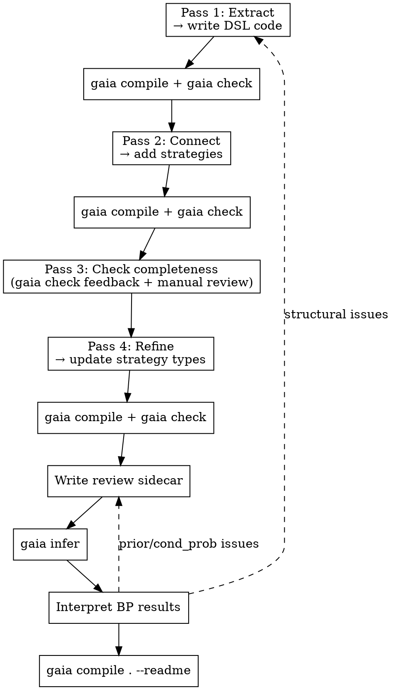
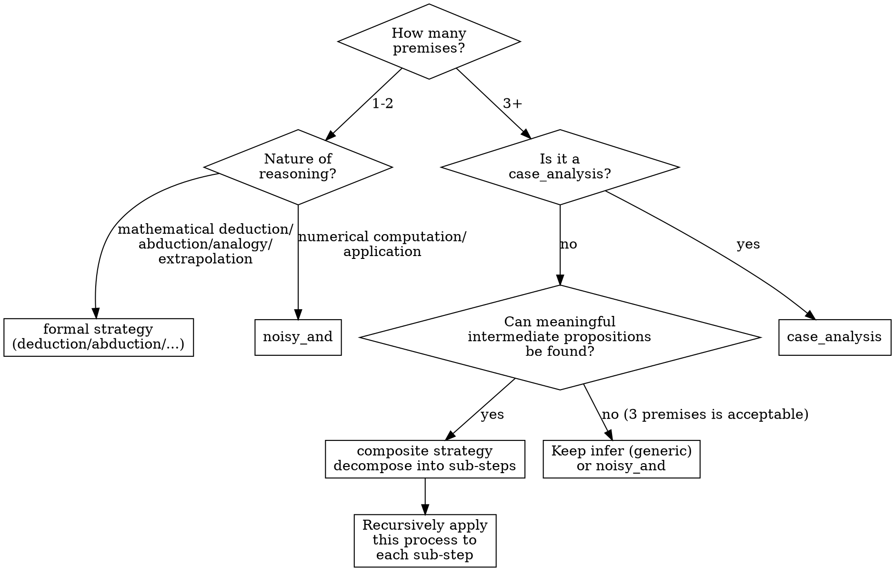

# Knowledge Formalization

Extract the knowledge structure from a source (scientific paper, textbook, technical report, etc.) into a Gaia knowledge package with claims, reasoning strategies, and review sidecars.

**REQUIRED:** Use **gaia-cli** skill for CLI commands (compile, check, infer, register) and **gaia-lang** skill for DSL syntax (claim, setting, strategies, operators).

## Overview

Formalization is a **four-pass** process. Each pass builds on the previous one. Do NOT skip passes or combine them.

**Key principle: Formalization is incremental.** After completing each pass, write code, compile, and check. Do not wait until all passes are done before writing code. Feedback from `gaia compile` and `gaia check` is critical input for the next pass.



## Pass 0: Prepare Artifacts

Copy the original source materials into the package's `artifacts/` directory:

```
my-package-gaia/
├── artifacts/              # Original source materials
│   ├── paper.pdf           # PDF original, or
│   ├── paper.md            # markdown version, or
│   └── chapter3.md         # textbook chapter, etc.
├── src/
│   └── my_package/
│       ├── __init__.py
│       ├── motivation.py
│       └── ...
└── pyproject.toml
```

Both PDF and markdown formats are supported. Throughout the formalization process, always refer back to the originals in `artifacts/` to ensure that numbers, formulas, and reasoning steps are consistent with the source material.

## Pass 1: Extract Knowledge Nodes

Read the source **section by section**. For each section, identify:

| Type | Criterion | Examples |
|------|-----------|---------|
| **setting** | Background facts that cannot be questioned | Mathematical definitions, formal setups, fundamental principles |
| **claim** | Propositions that can be questioned or falsified | Computation results, theoretical derivations, predictions, experimental observations |
| **question** | Questions to be answered | Research questions |

### Organizing by Module

Each section corresponds to a Gaia module (Python file):

- Introduction → `motivation.py`
- Section II → `s2_xxx.py`
- ...

The module's docstring serves as the section heading. Each knowledge node should have a `title` parameter.

### Place Knowledge in the Earliest Module

Each knowledge node belongs in the module corresponding to the section where it **first appears** in the source. Content from the Introduction goes into `motivation.py`.

Claims in motivation can be freely referenced as premises or background by later modules — they are not restricted by module membership. Settings and questions are typically referenced via `background=`.

### Setting vs Claim Classification Guide

**Principle: When in doubt between setting and claim, mark it as claim.**

| Category | Type | Examples |
|----------|------|---------|
| Mathematical definitions / formal setups | **setting** | Coordinate system choice, variable decomposition definitions, mathematical form of potentials |
| Established fundamental principles | **setting** | Conservation laws, exclusion principle, laws of thermodynamics |
| Standard approximation/method definitions (without applicability assertions) | **setting** | Mathematical expression of an approximation (definition only, not asserting applicability) |
| Whether applicability conditions hold | **claim** | Whether a certain approximation is applicable to a specific system |
| Theoretical frameworks dependent on conditions | **claim** | Theorem B holds when A is satisfied |
| Theoretical derivation results | **claim** | Renormalization relations, scaling laws, asymptotic behavior |
| Numerical computation results | **claim** | Values obtained from computational methods |
| Experimental observations | **claim** | Experimental measurements |

**Key criterion:** Can this proposition be questioned? If yes → claim. Only mathematical definitions and formal setups qualify as settings.

**Distinguish definitions from assertions:** The mathematical definition of an approximation is a setting, but "this approximation is unreliable under certain conditions" is a claim. "Decompose the variable into high- and low-frequency parts" is a setting (mathematical operation), but "the contribution of the high-frequency part is negligible" is a claim (physical assertion).

**Dependency chains:** If A is a setting and B depends on A being true while containing a physical assertion — B is typically a claim.

Content that the source itself derives — even if the derivation is rigorous — should be a claim, because the derivation process itself may contain errors.

### Atomicity Principle

Each claim must be an **atomic proposition** — one claim expresses one thing.

**Core rule: Theoretical predictions must be separated from experimental results.**

```python
# BAD: Mixing theory and experiment
result = claim("The model predicts X, the experimental value is Y, deviation Z%.")

# GOOD: Separated into independent claims
prediction = claim("Based on method XX, the model predicts a certain quantity as X.", title="Model prediction")
experiment = claim("The experimental measurement of a certain quantity is Y.", title="Experimental value")
```

Similarly, **method descriptions** and **method application results** should be separated:

```python
# BAD: Method and result mixed together
result = claim("Using method XX to compute YY yields ZZ.")

# GOOD: Separated
method = claim("Method XX employs ... strategy ...", title="Method description")
result = claim("The numerical result for YY is ZZ +/- delta.", title="Numerical result")
```

### Theory-Experiment Comparison → Abduction

When a theoretical prediction is compared with experimental data, use the **abduction** pattern:

- **observation**: experimental result
- **hypothesis**: prediction from the new theory
- **alternative**: prediction from the conventional/existing theory (alternative explanation)

```python
# abduction must provide an alternative (alternative theory)
_strat = abduction(
    observation=experimental_value,
    hypothesis=new_theory_prediction,
    alternative=old_theory_prediction,  # conventional theory as alternative explanation
    reason="The new theory's deviation is only X%, far better than the old theory's Y% deviation.")
```

**Note:** `abduction()` returns a Strategy (not a Knowledge). You must assign the return value to a variable (e.g., `_strat`) so it can be referenced in the review sidecar.

**Semantics of pi(Alt) -- critical:** In abduction, the prior pi(Alt) of the `alternative` represents: **"the probability that Alt alone can explain Obs without H"** -- not whether Alt's calculation is correct.

For example: If Obs = "experimental Tc = 1.2K" and Alt = "phenomenological theory predicts Tc = 1.9K", then although Alt's calculation itself is not wrong (the calculation indeed gives 1.9K), 1.9K cannot explain the observation of 1.2K. Therefore pi(Alt) should be **low** (e.g., 0.3), rather than high just because "the calculation is correct."

**Rule of thumb:** If pi(Alt) >= pi(H), it means the alternative theory's explanatory power is no weaker than the hypothesis -- this either means the abduction provides weak support for H, or pi(Alt) has been overestimated. The reviewer should examine carefully.

### Content Must Be Self-Contained

Each node's content must be a complete, independently understandable proposition. A reviewer reading it should not need additional context to make a judgment.

```python
# BAD: Requires context to understand
result = claim("The computed result significantly exceeds conventional estimates.")

# GOOD: Self-contained proposition
result = claim(
    "Using method XX to compute YY under condition ZZ yields A +/- delta, "
    "compared to the estimate B from conventional method WW, a deviation of approximately C-fold.",
    title="Result description",
)
```

### Pass 1 Review Checklist

After extracting all modules, check each claim against the following:

**Symbols must be self-explanatory:**
- Every mathematical symbol must have a brief explanation on its first appearance in that claim
- Example: Do not write "$\alpha \ll 1$"; write "the parameter $\alpha$ (ratio of XX to YY) is much less than 1"
- The physical meaning of subscripts/superscripts must be explicit

**Abbreviations must be expanded:**
- Every abbreviation must be expanded on its first appearance in that claim
- Example: Do not write "XXX computes $\lambda$"; write "the such-and-such method (XXX) computes the coupling constant $\lambda$"
- Even if an abbreviation has been expanded in another claim, each claim is independent and must expand it again

**No comparative assertions without reference:**
- Do not write "significantly larger than X" -- the reader does not know what is being compared
- Do not write "nearly exact agreement" -- the reader does not know what it agrees with
- Numerical comparisons must provide both values

**Sufficient detail:**
- Can a reader understand what this claim says by reading only this one claim?
- Are conditions and applicable ranges clear?
- Do numerical values include units and error bars?

### Marking Exported Conclusions

The source's **core contributions** (new theoretical results, new numerical computation results, new experimental findings, key arguments) should be marked as exported conclusions in `__all__`. These are this knowledge package's external interface -- other packages can reference them.

Criterion: If this result were removed from the source, the source would lose its core value.

### Pass 1 Deliverable

One claim/setting/question list per module.

Pass 1 only extracts atomic, self-contained knowledge nodes. **Do not prejudge which are "derived conclusions"** -- whether a claim is an independent premise or a derived one depends on how reasoning connections are established in Pass 2, not on the claim itself.

## Pass 2: Connect -- Write Infer Strategies

`infer` is the **most general** strategy type in Gaia -- it does not presume any specific reasoning pattern (such as deduction, abduction), and merely expresses "from premises, derive conclusion." Pass 2 uses `infer` as the draft form for all reasoning connections; specific strategy types are refined in Pass 4.

For each claim "supported by other claims," write an `infer` strategy (which claims need a strategy is determined case-by-case in Pass 2 -- if the source provides an argument for it, it needs one):

1. **Write a detailed reason**: Summarize the derivation process from the source -- not a one-sentence summary, but a complete reasoning chain. The reason should enable a domain reader to understand "why these premises lead to this conclusion."

2. **Identify premises and background**:
   - **Claims** used in the derivation → `premises`
   - **Settings/questions** used in the derivation → `background`

### Use @label References in Reasons

In the reason text, use `@label` syntax to explicitly reference knowledge nodes used in the derivation:

```python
reason=(
    "Based on the XX framework (@framework_claim), under condition YY (@condition_claim), "
    "conclusion ZZ can be derived. The derivation uses the property of WW (@property_setting)."
)
```

Nodes referenced by `@label` must appear in the strategy's `premises` or `background` list. This is verified in Pass 3.

### Key Point for Pass 2: Do Not Miss Implicit Premises

Sources often have implicit premises. When writing the reason, if you discover the derivation depends on a knowledge node already extracted in Pass 1, be sure to add it to premises or background and reference it with `@label` in the reason.

## Pass 3: Check Completeness

**Prerequisite:** Code from Pass 1-2 has been written and passes `gaia compile` and `gaia check`. Pass 3 combines `gaia check` feedback with manual review.

### 3a. Check @label Reference Consistency

Review each infer strategy's reason one by one:

1. **Re-read the reason**: Carefully read every sentence in the reason
2. **Check @label coverage**: Every `@label` in the reason must appear in premises or background
3. **Reverse check**: Every node in premises/background should be referenced by `@label` in the reason (otherwise, why is it a premise?)
4. **Check if additional knowledge is needed**: If the reason mentions an important fact without a corresponding `@label`, go back to Pass 1 to add it

### 3b. Check for Claims Missing Reasoning

Use the output of `gaia check` to see if any claim should have reasoning support but lacks a strategy:

- `gaia check` reports claims that are not the conclusion of any strategy (i.e., leaf nodes)
- Review each leaf node: Is it truly an independent premise? Or should it have an infer strategy?
- Criterion: If the source provides an argument for this claim (not just a statement), it should have a strategy

### 3c. Check for Isolated Nodes

- Are there claims that are neither a premise/background of any strategy nor a conclusion of any strategy?
- Isolated nodes indicate they do not participate in the reasoning graph -- either they should not exist, or a strategy referencing them was missed

The most common mistake at this step is **assuming certain knowledge does not need explicit references**. In Gaia, if the reasoning process depends on a fact, that fact must be a node in the knowledge graph.

## Pass 4: Refine Strategy Types

Passes 2-3 produce generic `infer` strategies. Pass 4 refines each `infer` into a specific strategy type.

### Decision Tree



### Case 1: 1-2 Premises

First determine the nature of reasoning, then choose the strategy type:

| Nature of Reasoning | Strategy | Conditional Probability |
|---------------------|----------|------------------------|
| Strict mathematical derivation (conclusion necessarily follows from premises) | `deduction` | Deterministic (no parameters needed) |
| Numerical computation / application (computational error or empirical uncertainty) | `noisy_and` | Requires conditional_prob |
| Observation → hypothesis | `abduction` | Determined by strategy semantics |
| Source → target analogy | `analogy` | Determined by strategy semantics |
| Extrapolation | `extrapolation` | Determined by strategy semantics |
| Induction (multiple observations → general rule) | `induction` | Determined by sub-abduction semantics |
| Process of elimination (exhaustiveness + excluded candidates → survivor) | `elimination` | Determined by strategy semantics |
| Inductive proof (base case + inductive step → law) | `mathematical_induction` | Determined by strategy semantics |

**Key distinction: deduction vs noisy_and**

`deduction` represents **purely deterministic mathematical derivation** -- the derivation steps themselves are error-free, and uncertainty comes only from whether the premises hold. In BP, the deduction potential is deterministic (conjunction + implication, Cromwell softened), carrying no adjustable parameters.

Criterion: "If all premises are true, does this derivation **necessarily** hold mathematically?"

- **Yes** → `deduction`. Examples: mathematical proofs, logical syllogisms, reading directly from a definition
- **No** → `noisy_and`. Examples: numerical computations with approximation errors, empirical judgments, omitted premises, "usually holds but has exceptions"

Common misjudgments:
- A derivation in the source looks "rigorous" but omits conditions → use `noisy_and` (omitted conditions = implicit uncertainty)
- Conclusion read directly from a definition (e.g., "A is defined as B, therefore A=B") → use `deduction`
- Numerical DFT/MD computation yields a result → use `noisy_and` (the computational method itself has uncertainty)

**Strategy variable naming:** All strategies that need to be referenced in the review sidecar must be assigned to variables (`_strat_xxx = noisy_and(...)`). Deduction does not need parameters and can be called anonymously.

### Case 2: 3+ Premises

**First check**: Is this a `case_analysis` pattern?

**If not case_analysis**: Try decomposing into a `composite` strategy. Intermediate claims introduced during decomposition should be meaningful propositions, not created purely for the sake of splitting. The composite's coarse graph (top-level premises → conclusion) preserves the original `infer`'s perspective, while the fine graph (sub-strategies) provides step-by-step derivation.

**If no meaningful intermediate propositions can be found** (i.e., decomposition would be forced):
- **3 premises**: Acceptable to keep as `infer` or `noisy_and`
- **4+ premises**: Must decompose, otherwise the BP multiplicative effect will severely suppress belief

### Operator Usage

For operator semantics and syntax, see the **gaia-lang** skill.

## Write DSL Code

After completing each pass, write code, compile, and check. For DSL syntax, see the **gaia-lang** skill.

## Write Review Sidecar

The review sidecar assigns priors to claims and conditional probabilities to strategies. These are the parameters that drive BP inference.

| Node Type | Prior | Notes |
|-----------|-------|-------|
| Independent premises (leaf nodes) | Reviewer's judgment (0.5-0.95) | Reflects evidence strength |
| Derived conclusions | Do not set prior | Belief is entirely determined by BP propagation |
| Orphaned claims (background-only) | Must set prior (validator requires it) | Typically 0.90-0.95 |
| deduction strategy | Deterministic, no parameters needed | |
| noisy_and strategy | `conditional_probability` (single value) | Reflects computation/reasoning reliability |
| infer strategy (N premises) | `conditional_probabilities` (2^N values, CPT) | Full conditional probability table |
| composite strategy | Top-level needs CPT (2^N values) | For collapsed mode |
| Generated claims (abduction alternative) | Reviewer's judgment | `review_generated_claim` |
| Explicit abduction alternative | Prior reflects **explanatory power**, not computational correctness | `review_claim` |

For review sidecar API details, see the **gaia-cli** skill.

## Generate README

Run `gaia infer .` then `gaia compile . --readme` to generate a README with Mermaid graph and belief values. See the **gaia-cli** skill for details.

## Interpret BP Results

After compiling and running inference, check:

| Check | Normal | Abnormal |
|-------|--------|----------|
| Independent premises | belief approx prior (small change) | belief significantly pulled down → downstream constraint conflict |
| Derived conclusions | belief > 0.5 (pulled up) | belief < 0.5 → see below |
| Contradiction | One side high, one side low ("picks a side") | Both sides low → prior assignment issue |

### Common Issues and Fixes

**Derived conclusion belief too low (< 0.3):**
- **Cause A:** Reasoning chain too deep, multiplicative effect suppresses belief. Check if Pass 4 used composite to control depth.
- **Cause B:** Premise priors not high enough. Re-examine the review sidecar.
- **Cause C:** Strategy's conditional_probability is unreasonable.

**Contradiction does not correctly "pick a side":**
- **Cause:** The priors on both sides do not reflect the actual difference in evidence strength.
- **Fix:** Lower the prior of the side that should be overturned.

**Derived conclusion belief approx 0.5 (not pulled up):**
- **Cause:** Reasoning chain is broken; some strategy is missing its conditional_probability.
- **Fix:** Check if the review sidecar is missing a strategy review.

## Common Mistakes

| Mistake | Consequence | Fix |
|---------|-------------|-----|
| Theoretical prediction and experimental result mixed in one claim | Cannot model the verification relationship with abduction | Separate into two claims + abduction |
| Abduction without providing an alternative | Missing comparison with alternative theory | Provide existing theory as alternative |
| Abduction alternative's prior reflects "computational correctness" instead of "explanatory power" | pi(Alt) too high, weakens abduction's support for H | pi(Alt) should answer "Can Alt independently explain Obs?", not "Is Alt's calculation correct?" |
| Reason written too briefly (one sentence) | Reasoning process is untraceable | Summarize derivation steps in detail, reference with @label |
| 4+ premise flat noisy_and | Severe BP multiplicative effect | Use composite to decompose into sub-steps with 3 or fewer premises |
| Content not self-contained (symbols/abbreviations unexplained) | Reviewer cannot judge independently | Each claim must independently explain all symbols and abbreviations |
| Marking a questionable proposition as setting | That proposition cannot be updated via BP | When in doubt, mark as claim; only mathematical definitions are settings |
| Marking a condition-dependent theoretical framework as setting | Framework does not participate in BP | Condition-dependent conclusions should be claims |
| Using noisy_and for mathematical deduction | Deterministic derivation should not have probability parameters | Use deduction (purely deterministic, no cond_prob needed) |
| Using deduction for numerical computation/approximate reasoning | Computation has uncertainty, but deduction is purely deterministic | Use noisy_and (needs cond_prob to express reasoning strength) |
| Using deduction for "seemingly rigorous" derivation | Source omits premises or conditions | Omitted premises = implicit uncertainty → use noisy_and |
| Anonymous strategy call | Review sidecar cannot reference it | Assign to `_strat_xxx` variable |
| Missing prior for orphaned claim | `gaia infer` errors | All claims (including orphaned) need priors |
| Missing implicit premises in reasoning | Knowledge graph is incomplete | Use `gaia check` + manual review in Pass 3 |
| Not verifying numerical values | Data errors | Cross-check every value against the source |

## Reference

- **gaia-lang** skill -- DSL syntax, knowledge types, operators, and API reference
- **gaia-cli** skill -- CLI commands (compile, check, infer, register) and review sidecar API
