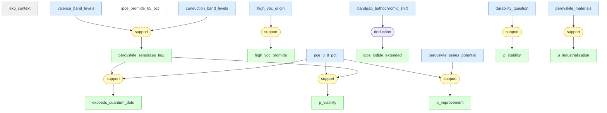

# pvsk_kojima2009 — Overview

```mermaid
graph TD
    exp_context["exp_context"]:::setting
    perovskite_materials["perovskite_materials"]:::premise
    pce_3_8_pct["pce_3_8_pct"]:::premise
    high_voc_bromide["high_voc_bromide"]:::derived
    perovskite_sensitizes_tio2["perovskite_sensitizes_tio2"]:::derived
    ipce_bromide_65_pct["ipce_bromide_65_pct"]:::orphan
    ipce_iodide_extended["ipce_iodide_extended"]:::derived
    bandgap_bathochromic_shift["bandgap_bathochromic_shift"]:::premise
    valence_band_levels["valence_band_levels"]:::premise
    conduction_band_levels["conduction_band_levels"]:::premise
    high_voc_origin["high_voc_origin"]:::premise
    exceeds_quantum_dots["exceeds_quantum_dots"]:::derived
    perovskite_series_potential["perovskite_series_potential"]:::premise
    durability_question["durability_question"]:::premise
    p_viability["p_viability"]:::derived
    p_improvement["p_improvement"]:::derived
    p_stability["p_stability"]:::derived
    p_industrialization["p_industrialization"]:::derived
    strat_0(["support"]):::weak
    valence_band_levels --> strat_0
    conduction_band_levels --> strat_0
    strat_0 --> perovskite_sensitizes_tio2
    strat_1(["deduction"])
    bandgap_bathochromic_shift --> strat_1
    strat_1 --> ipce_iodide_extended
    strat_2(["support"]):::weak
    high_voc_origin --> strat_2
    strat_2 --> high_voc_bromide
    strat_3(["support"]):::weak
    perovskite_sensitizes_tio2 --> strat_3
    pce_3_8_pct --> strat_3
    strat_3 --> exceeds_quantum_dots
    strat_4(["support"]):::weak
    pce_3_8_pct --> strat_4
    perovskite_sensitizes_tio2 --> strat_4
    strat_4 --> p_viability
    strat_5(["support"]):::weak
    pce_3_8_pct --> strat_5
    perovskite_series_potential --> strat_5
    strat_5 --> p_improvement
    strat_6(["support"]):::weak
    durability_question --> strat_6
    strat_6 --> p_stability
    strat_7(["support"]):::weak
    perovskite_materials --> strat_7
    strat_7 --> p_industrialization

    classDef setting fill:#f0f0f0,stroke:#999,color:#333
    classDef premise fill:#ddeeff,stroke:#4488bb,color:#333
    classDef derived fill:#ddffdd,stroke:#44bb44,color:#333
    classDef question fill:#fff3dd,stroke:#cc9944,color:#333
    classDef background fill:#f5f5f5,stroke:#bbb,stroke-dasharray: 5 5,color:#333
    classDef orphan fill:#fff,stroke:#ccc,stroke-dasharray: 5 5,color:#333
    classDef external fill:#fff,stroke:#aaa,stroke-dasharray: 3 3,color:#333
    classDef weak fill:#fff9c4,stroke:#f9a825,stroke-dasharray: 5 5,color:#333
    classDef contra fill:#ffebee,stroke:#c62828,color:#333
```
