# 01 - Root

```mermaid
graph TD
    exp_context["exp_context"]:::setting
    perovskite_materials["perovskite_materials"]:::premise
    pce_3_8_pct["pce_3_8_pct"]:::premise
    high_voc_bromide["high_voc_bromide"]:::derived
    perovskite_sensitizes_tio2["perovskite_sensitizes_tio2"]:::derived
    ipce_bromide_65_pct["ipce_bromide_65_pct"]:::orphan
    ipce_iodide_extended["ipce_iodide_extended"]:::derived
    bandgap_bathochromic_shift["bandgap_bathochromic_shift"]:::premise
    valence_band_levels["valence_band_levels"]:::premise
    conduction_band_levels["conduction_band_levels"]:::premise
    high_voc_origin["high_voc_origin"]:::premise
    exceeds_quantum_dots["exceeds_quantum_dots"]:::derived
    perovskite_series_potential["perovskite_series_potential"]:::premise
    durability_question["durability_question"]:::premise
    p_viability["p_viability"]:::derived
    p_improvement["p_improvement"]:::derived
    p_stability["p_stability"]:::derived
    p_industrialization["p_industrialization"]:::derived
    strat_0(["support"]):::weak
    valence_band_levels --> strat_0
    conduction_band_levels --> strat_0
    strat_0 --> perovskite_sensitizes_tio2
    strat_1(["deduction"])
    bandgap_bathochromic_shift --> strat_1
    strat_1 --> ipce_iodide_extended
    strat_2(["support"]):::weak
    high_voc_origin --> strat_2
    strat_2 --> high_voc_bromide
    strat_3(["support"]):::weak
    perovskite_sensitizes_tio2 --> strat_3
    pce_3_8_pct --> strat_3
    strat_3 --> exceeds_quantum_dots
    strat_4(["support"]):::weak
    pce_3_8_pct --> strat_4
    perovskite_sensitizes_tio2 --> strat_4
    strat_4 --> p_viability
    strat_5(["support"]):::weak
    pce_3_8_pct --> strat_5
    perovskite_series_potential --> strat_5
    strat_5 --> p_improvement
    strat_6(["support"]):::weak
    durability_question --> strat_6
    strat_6 --> p_stability
    strat_7(["support"]):::weak
    perovskite_materials --> strat_7
    strat_7 --> p_industrialization

    classDef setting fill:#f0f0f0,stroke:#999,color:#333
    classDef premise fill:#ddeeff,stroke:#4488bb,color:#333
    classDef derived fill:#ddffdd,stroke:#44bb44,color:#333
    classDef question fill:#fff3dd,stroke:#cc9944,color:#333
    classDef background fill:#f5f5f5,stroke:#bbb,stroke-dasharray: 5 5,color:#333
    classDef orphan fill:#fff,stroke:#ccc,stroke-dasharray: 5 5,color:#333
    classDef external fill:#fff,stroke:#aaa,stroke-dasharray: 3 3,color:#333
    classDef weak fill:#fff9c4,stroke:#f9a825,stroke-dasharray: 5 5,color:#333
    classDef contra fill:#ffebee,stroke:#c62828,color:#333
```

## Claims

### [[exp_context|#01 exp context]] ★
> Photoelectrochemical cells constructed with CH3NH3PbX3 (X=Br, I) nanocrystalline particles self-organized on mesoporous TiO2 (8-12 um thick) deposited on FTO glass, using organic electrolyte with lithium halide/halogen redox couple, measured under AM 1.5 simulated sunlight at 100 mW/cm2

Prior: — → Belief: —

### [[perovskite_materials|#02 perovskite materials]] ★
> Organolead halide perovskite compounds CH3NH3PbBr3 (cubic, a=5.9 A) and CH3NH3PbI3 (tetragonal, a=8.855 A, c=12.659 A) synthesized from abundant sources Pb, C, N, and halogen, deposited from precursor solutions via spin-coating

Prior: 0.70 → Belief: —

### [[pce_3_8_pct|#03 pce 3 8 pct]] ★
> CH3NH3PbI3-sensitized photoelectrochemical cell achieves power conversion efficiency of 3.81% under AM 1.5 simulated sunlight at 100 mW/cm2, with Jsc=11.0 mA/cm2, Voc=0.61 V, and fill factor 0.57

Prior: 0.90 → Belief: —

### [[ipce_bromide_65_pct|#04 ipce bromide 65 pct]] ★
> CH3NH3PbBr3/TiO2 cell achieves maximum IPCE of 65% in the visible region (lambda < 600 nm) with sharp band-gap absorption onset near 570 nm

Prior: 0.88 → Belief: —

### [[bandgap_bathochromic_shift|#05 bandgap bathochromic shift]] ★
> Halogen substitution from Br to I in CH3NH3PbX3 causes a bathochromic shift in absorption, analogous to silver halide ionic crystals

Prior: 0.85 → Belief: —

### [[valence_band_levels|#06 valence band levels]] ★
> Valence-band levels of CH3NH3PbBr3 and CH3NH3PbI3 are at ~5.38 and 5.44 eV versus vacuum level, respectively, as measured by photoelectron spectroscopy

Prior: 0.85 → Belief: —

### [[conduction_band_levels|#07 conduction band levels]] ★
> Conduction-band levels of CH3NH3PbBr3 and CH3NH3PbI3 are at ~3.36 and 4.0 eV respectively, allowing electron injection into the TiO2 conduction band (~4.0 eV)

Prior: 0.83 → Belief: —

### [[high_voc_origin|#08 high voc origin]] ★
> The high Voc of 0.96 V in CH3NH3PbBr3 cells is due to the more positive electrochemical potential of the Br2/Br- redox couple compared to I2/I-, expanding the range of photovoltage

Prior: 0.78 → Belief: —

### [[perovskite_series_potential|#09 perovskite series potential]] ★
> A series of organic-inorganic perovskite materials CH3NH3MX3 (M=Pb, Sn; X=halogen) with different energy gaps are targets for optimizing photovoltaic cell performance

Prior: 0.65 → Belief: —

### [[durability_question|#10 durability question]] ★
> How can the photocurrent decay observed under continuous irradiation for open cells exposed to air be mitigated to improve perovskite photovoltaic cell lifetime?

Prior: 0.50 → Belief: —

### [[p_improvement|#11 p_improvement]]
> Perovskite solar cell efficiency can be continuously improved through materials engineering, interface engineering, and compositional engineering

Prior: 0.30 → Belief: —

### [[high_voc_bromide|#12 high voc bromide]] ★
> CH3NH3PbBr3-sensitized cell yields a high open-circuit voltage of 0.96 V with Jsc=5.57 mA/cm2, fill factor 0.59, and PCE of 3.13%

Prior: 0.90 → Belief: —

### [[p_stability|#13 p_stability]]
> Perovskite solar cells can achieve operational stability sufficient for practical deployment (>1000 hours under standard test conditions)

Prior: 0.20 → Belief: —

### [[perovskite_sensitizes_tio2|#14 perovskite sensitizes tio2]] ★
> Organolead halide perovskite nanocrystalline particles efficiently sensitize mesoporous TiO2 for visible-light conversion, confirmed by anodic photocurrent generation and IPCE measurements

Prior: 0.88 → Belief: —

### [[p_industrialization|#15 p_industrialization]]
> Perovskite solar cells can be scaled to module/panel level and industrially manufactured via roll-to-roll or slot-die processes

Prior: 0.15 → Belief: —

### [[ipce_iodide_extended|#16 ipce iodide extended]] ★
> CH3NH3PbI3/TiO2 cell shows extended spectral response to 800 nm but lower peak IPCE of 45%, reflecting broader but less intense absorption

Prior: 0.85 → Belief: —

### [[p_viability|#17 p_viability]]
> Organometal halide perovskites can function as viable photovoltaic absorbers

Prior: 0.30 → Belief: —

### [[exceeds_quantum_dots|#18 exceeds quantum dots]] ★
> The 3.81% PCE of the CH3NH3PbI3 cell is significantly higher than efficiencies obtained to date with non-organic sensitizers and quantum dots (CdS, CdSe, PbS, InP, InAs)

Prior: 0.85 → Belief: —
