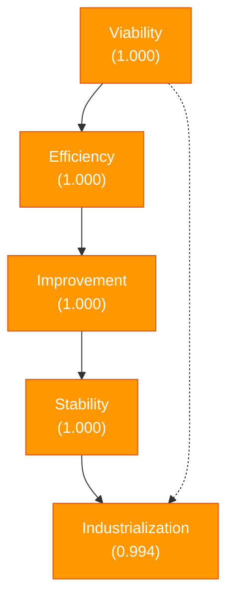

```mermaid
graph TB
    p_viability["Viability\n(1.000)"]
    p_efficiency["Efficiency\n(1.000)"]
    p_improvement["Improvement\n(1.000)"]
    p_stability["Stability\n(1.000)"]
    p_industrialization["Industrialization\n(0.994)"]
    p_viability --> p_efficiency
    p_efficiency --> p_improvement
    p_improvement --> p_stability
    p_stability --> p_industrialization
    p_viability -.-> p_industrialization

    classDef meta fill:#FF9800,stroke:#E65100,color:#fff
    class p_viability,p_efficiency,p_improvement,p_stability,p_industrialization meta
```